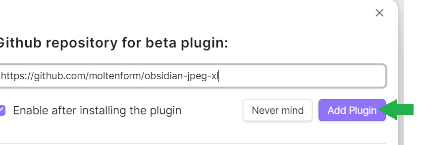

# obsidian-jpeg-xl

Show JPEG XL (jxl) images in Obsidian

Confirmed to work on Linux, Mac, Windows, iOS, Android.

## Installing (via "BRAT")

Go to Settings, then to Community Plugins.

At the top of the page it should say "Restricted mode is off." If it doesn't, press the button to turn it off.

Then click the "Browse" button. 

Search for "BRAT" and click the result.

Click "Install".

Click "Enable".

Click "Options".

About halfway down the page, click "Add Beta plugin".

Type in `https://github.com/moltenform/obsidian-jpeg-xl` and click "Add Plugin"

You should now be able to open .jxl images!

## Installing manually

- Go to the <a href="https://github.com/moltenform/obsidian-jpeg-xl/releases">releases</a> tab.
- Download `main.js`, `manifest.json`, and `styles.css`
- Go to one of your obsidian vaults, and open its `.obsidian` directory.
- Create a directory with the path `.obsidian/plugins/obsidian-jpeg-xl`
- Copy `main.js`, `manifest.json`, and `styles.css` into the path `.obsidian/plugins/obsidian-jpeg-xl`
- Re-open the obsidian vault and go to Settings, and then to Community Plugins.
- At the top of the page it should say "Restricted mode is off." If it doesn't, press the button to turn it off.
- Scroll down on the Community Plugins settings and enable the plugin that says "JPEG XL".

You should now be able to open .jxl images!

## Building from source

In a terminal, get the obsidian-jpeg-xl source code, and then run

- npm install
- npm run build
- Then a file `main.js` should appear.
- Go to one of your obsidian vaults, and open its `.obsidian` directory.
- Create a directory with the path `.obsidian/plugins/obsidian-jpeg-xl`
- Copy `main.js`, `manifest.json`, and `src/styles.css` into the path `.obsidian/plugins/obsidian-jpeg-xl`
- Re-open the obsidian vault and go to Settings, and then to Community Plugins.
- At the top of the page it should say "Restricted mode is off." If it doesn't, press the button to turn it off.
- Scroll down on the Community Plugins settings and enable the plugin that says "JPEG XL".

You should now be able to open .jxl images!

## Details

Released under the MIT license.

- Uses jxl-oxide (MIT license)
- Uses lru-cache (ISC license)

Note that linked jxl images within your standard markdown notes still won't work. That might be potentially offered by this plugin in the future, or by waiting for Chrome to support the jxl format.

Will be added as a community plugin as soon as the Obsidian team reviews it.

